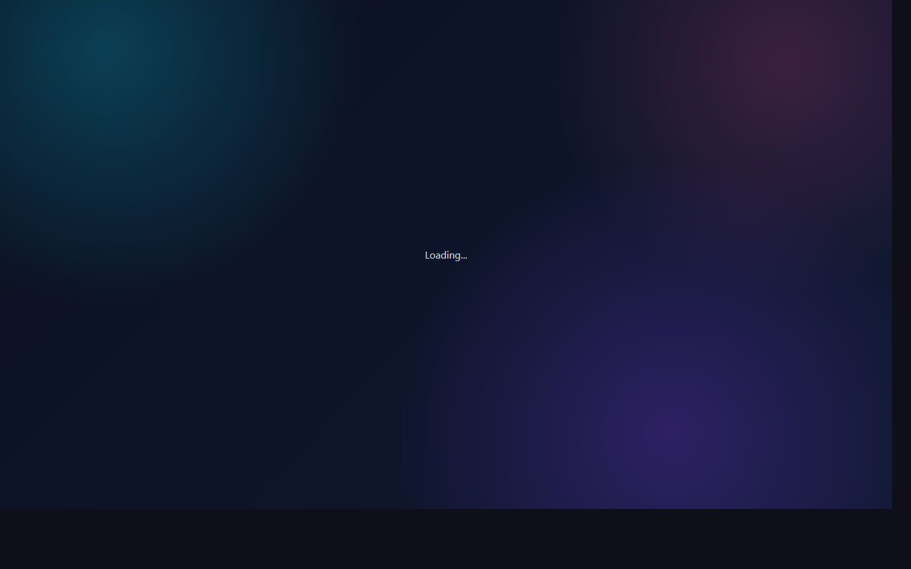
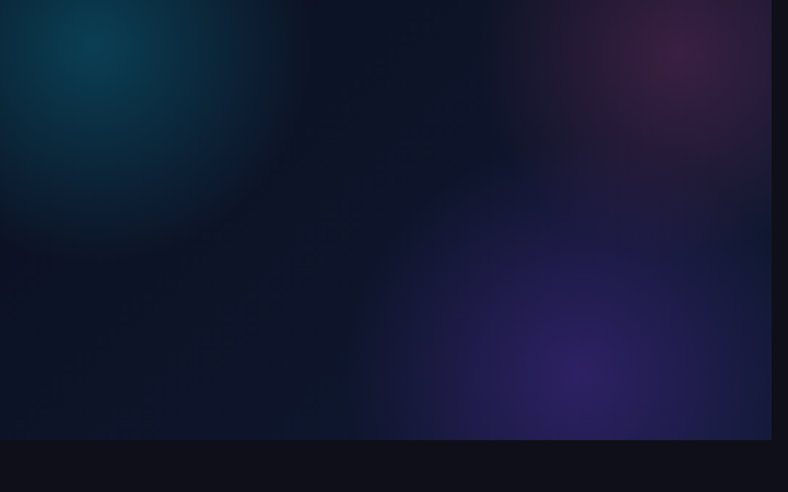

# DSA Preparation Tracker (MERN)

Repository Name: `dsa-prep-tracker`

A full-stack multi-user DSA preparation tracker built with MongoDB, Express, React, and Node.js.
Each user gets a personal dashboard, spaced-repetition revision queue, analytics, bookmarks, and company-wise sheets.

## Features

- JWT authentication (register/login/profile)
- Multi-user isolated progress tracking
- 150 seeded LeetCode-style problems
- 20 seeded DSA pattern notes
- Mark solved with attempt history + spaced repetition
- Revision buckets: overdue, due today, upcoming
- In-app notifications
- Company-wise sheets (FAANG + other companies)
- Analytics dashboard (charts + heatmap)
- Weekly planner + leaderboard
- Light/Dark theme with mobile responsive UI

## Tech Stack

- Frontend: React + Vite, Tailwind CSS, Recharts, Axios
- Backend: Node.js, Express.js, Mongoose, JWT, bcrypt
- Database: MongoDB Atlas / MongoDB local

## Project Structure

```text
client/   # React frontend
server/   # Express backend
```

## Environment Variables

Create root `.env`:

```env
MONGO_URI=your_mongodb_uri
JWT_SECRET=your_jwt_secret
PORT=5000
CLIENT_URL=http://localhost:5173
NODE_ENV=development
```

## Run Locally

```bash
npm install
npm install --prefix server
npm install --prefix client
```

Seed data:

```bash
npm run seed:problems
npm run seed:patterns
```

Start both frontend and backend:

```bash
npm run dev
```

- Frontend: `http://localhost:5173`
- Backend: `http://localhost:5000`

## Deploy on Render (GitHub)

This repo includes `render.yaml` so you can deploy frontend + backend from GitHub in one setup.

1. Push latest code to GitHub.
2. In Render, click **New +** -> **Blueprint**.
3. Connect your GitHub repo and select `dsa-prep-tracker`.
4. Render will detect `render.yaml` and create 2 services:
   - `dsa-prep-tracker-api` (Node backend)
   - `dsa-prep-tracker-web` (Static frontend)
5. Set backend environment variables in Render (`dsa-prep-tracker-api`):
   - `MONGO_URI` = your MongoDB Atlas URI
   - `JWT_SECRET` = strong random string
   - `CLIENT_URL` = your frontend Render URL (example: `https://dsa-prep-tracker-web.onrender.com`)
6. Set frontend environment variable in Render (`dsa-prep-tracker-web`):
   - `VITE_API_URL` = your backend API URL + `/api` (example: `https://dsa-prep-tracker-api.onrender.com/api`)
7. Redeploy both services after env vars are set.
8. Seed production database once from backend Shell:
   - `npm run seed:problems`
   - `npm run seed:patterns`

### Manual Render Setup (without Blueprint)

- Backend Web Service:
  - Root Directory: `server`
  - Build Command: `npm install`
  - Start Command: `npm start`
- Frontend Static Site:
  - Root Directory: `client`
  - Build Command: `npm install && npm run build`
  - Publish Directory: `dist`
  - Rewrite Rule: `/* -> /index.html`
## Screenshots

### Login


### Register


### Company Sheets


## API Highlights

- `POST /api/auth/register`
- `POST /api/auth/login`
- `GET /api/problems`
- `GET /api/problems/companies`
- `GET /api/problems/company/:companyName`
- `GET /api/problems/faang-top`
- `GET /api/patterns`
- `GET /api/user-problems/dashboard`

## License

MIT


